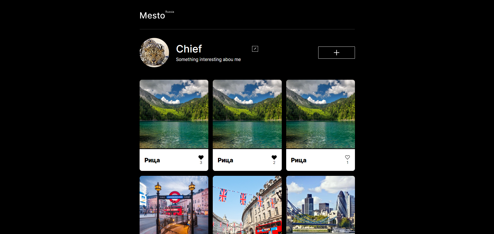

# Проектная работа Mesto
## Скриншот страницы работы

### Сайт проекта : [MESTO](<https://ustinskiydmitriy.github.io/mesto-project-ff/>)
## Используемые технологии: 
1. JavaScript
2. API
3. HTML
4. CSS
## В данной проектной работе реализовано:
1. Работа с API
2. Добавление новых карточек
3. Удаление карточек
4. Лайки
5. Валидация форм
6. Открытие, закрытие попапов
### Ссылка на репозиторий: <https://github.com/UstinskiyDmitriy/mesto-project-ff.git>

